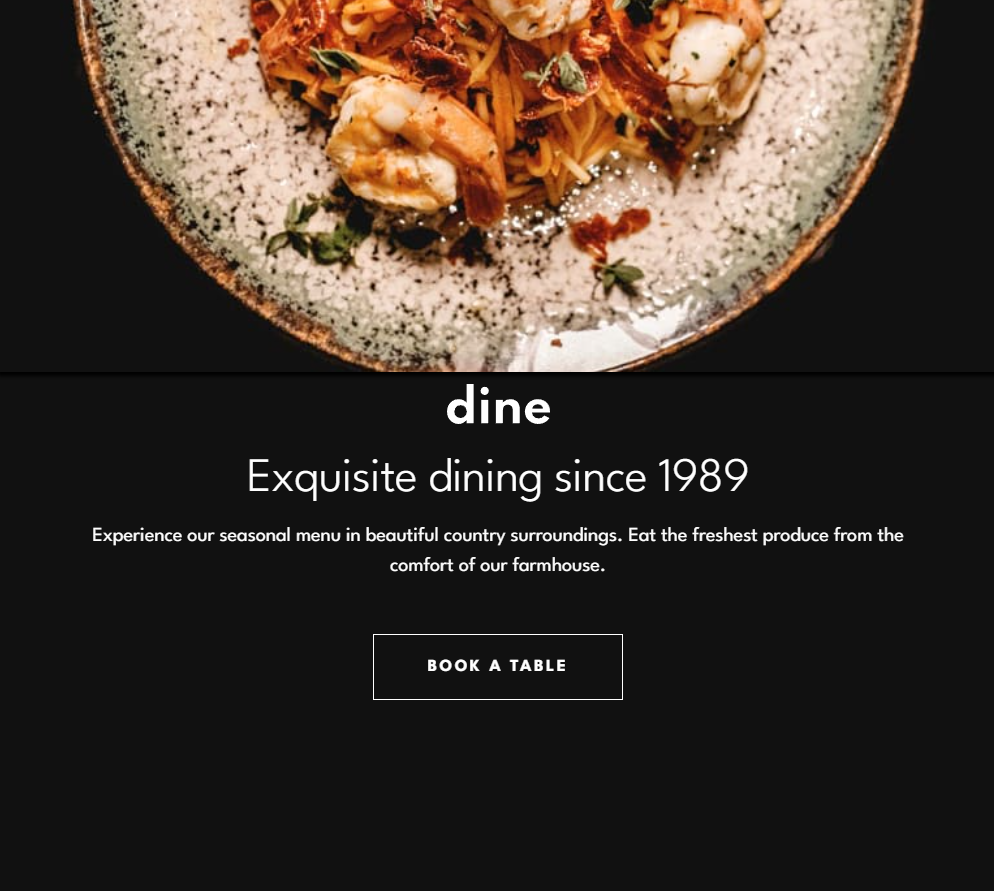
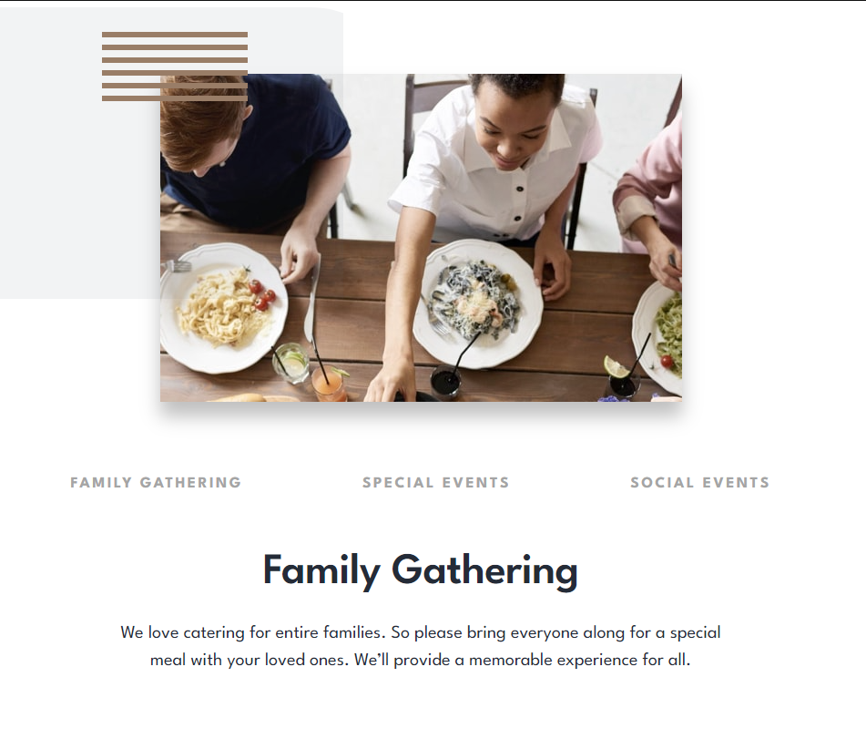
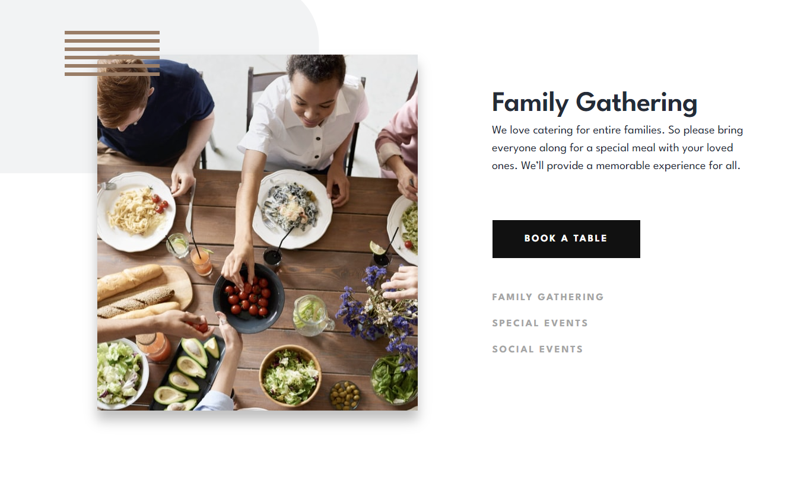
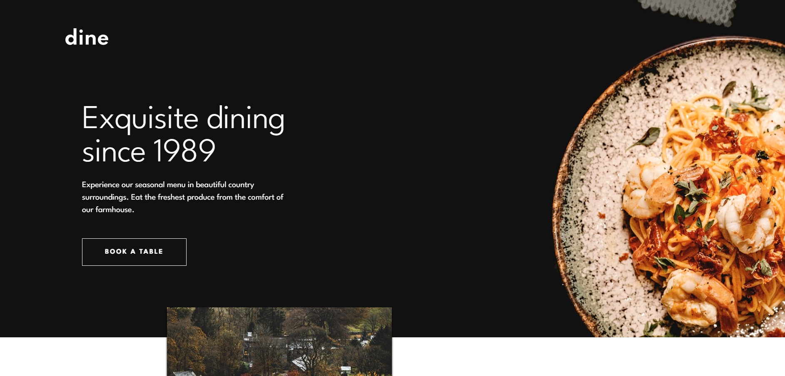

# Frontend Mentor - Dine Website Challenge Solution

This is a solution for the [Dine Website Challenge](https://www.frontendmentor.io/challenges/dine-restaurant-website-yAt7Vvxt7) on Frontend Mentor. Frontend Mentor challenges help you improve your coding skills by building realistic projects.

## Table of Contents

- [Overview](#overview)
  - [The Challenge](#the-challenge)
  - [Screenshot](#screenshot)
  - [Links](#links)
- [My Process](#my-process)
  - [Technologies Used](#technologies-used)
  - [What I Learned](#what-i-learned)
- [Author](#author)
- [Acknowledgments](#acknowledgments)

## Overview

### The Challenge

Users should be able to:

- View the optimal layout for each page depending on their device's screen size.
- See hover states for all interactive elements throughout the site.
- See the correct content for the "Family Gatherings," "Special Events," and "Social Events" tabs when they click on each one.
- Receive an error message when the reservation form is submitted if:
  - The `Name` or `Email Address` fields are empty, with the message "This field is required."
  - The `Email Address` is not in a valid format, with the message "Please use a valid email address."
  - Any of the `Select Date` or `Select Time` fields are empty, with the message "This field is missing."

### Screenshot

### Links

- Solution URL: [https://www.frontendmentor.io/profile/cemkarakuss]
- Live Site URL: [https://dinewebsiteblackbird.netlify.app/]

## My Process

- It was a 2-day process.
- I first analyzed the design and then created the HTML structure based on the design.
- For CSS, I started by creating variables, using the design file as a reference.
- Then I developed the overall design for mobile devices.
- I implemented tablet and desktop designs for responsiveness.
- I made the design functional using JavaScript.

### Technologies Used

I built this project using the following technologies:

- Semantic HTML5 markup
- CSS custom properties (Custom Properties)
- Flexbox
- Mobile-first workflow
- Animate.css
- Position properties in CSS
- Working with form elements
- JavaScript

### What I Learned

Some key takeaways from working on this project include:

- Understanding CSS position properties and how to apply them effectively.
- Capturing input values with JavaScript.
- Mastering CSS Flexbox.
- Enhancing the site's appearance by adding animations.
- The importance of using HTML classes and IDs.

## Author

- Cem Karakuş

## Acknowledgments

- Frontendmentor.io
