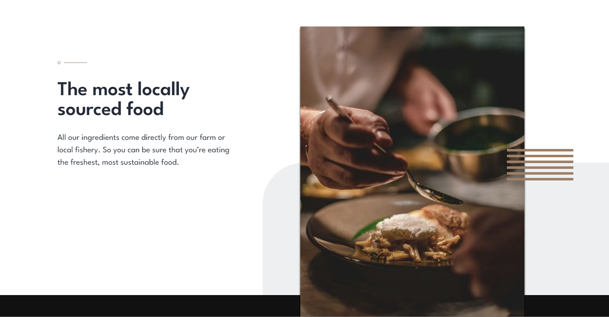
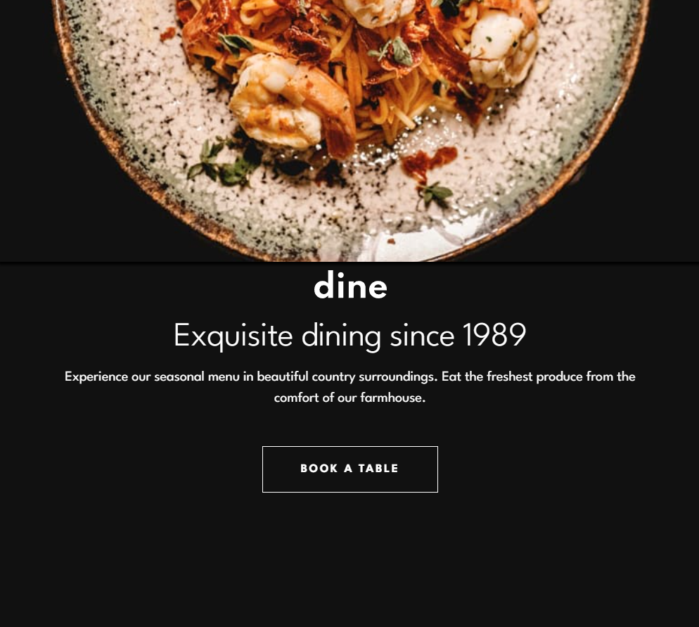
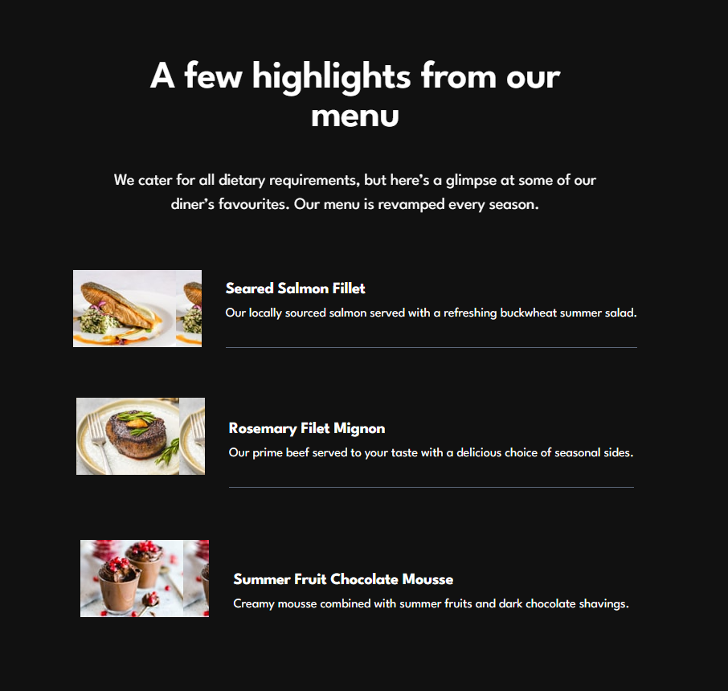
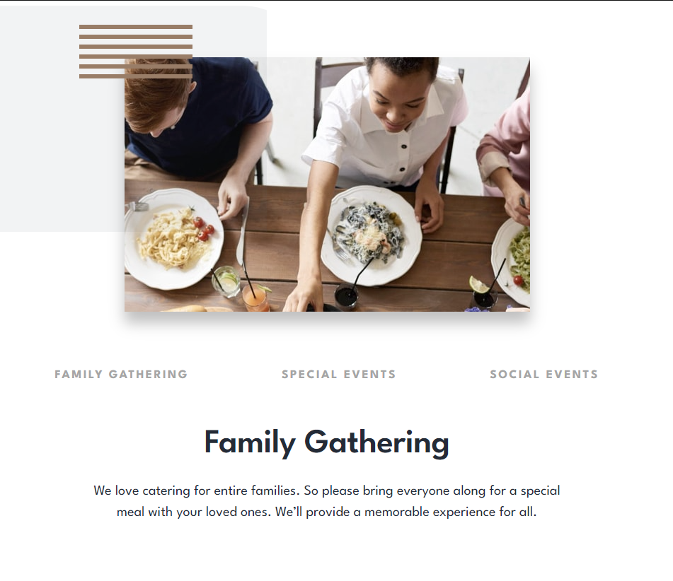
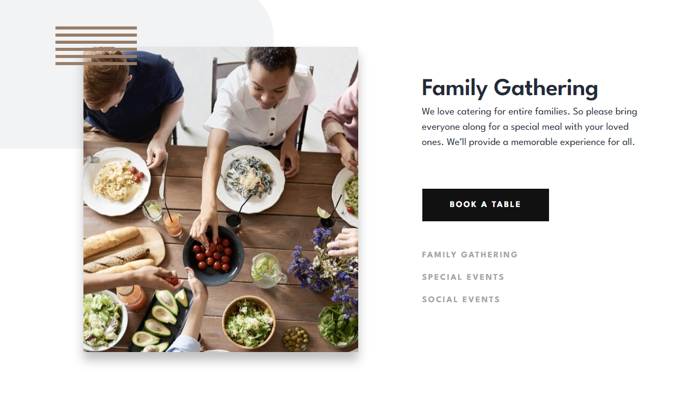
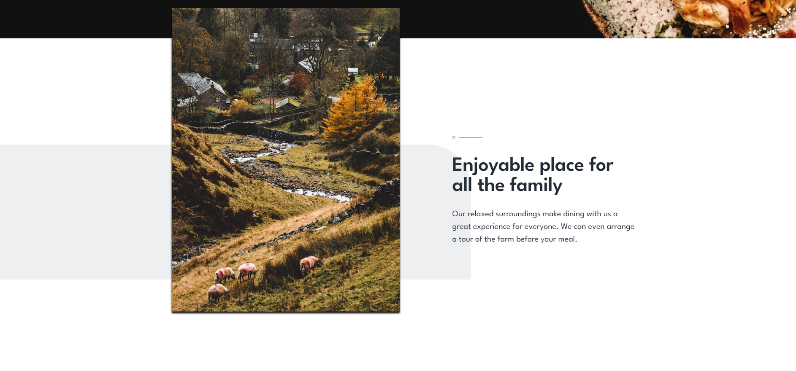
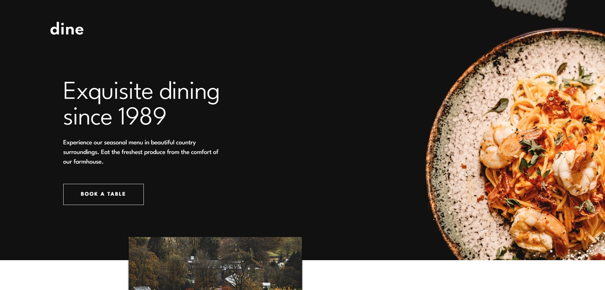

# Frontend Mentor - Dine Website Challenge Çözümü

Bu, Frontend Mentor'daki [Dine Website Challenge](https://www.frontendmentor.io/challenges/dine-restaurant-website-yAt7Vvxt7) görevine yönelik bir çözümdür. Frontend Mentor görevleri, gerçekçi projeler oluşturarak kodlama becerilerinizi geliştirmenize yardımcı olur.

## İçindekiler

- [Genel Bakış](#genel-bakış)
  - [Görev](#görev)
  - [Ekran Görüntüsü](#ekran-görüntüsü)
  - [Bağlantılar](#bağlantılar)
- [Çalışma Sürecim](#çalışma-sürecim)
  - [Kullanılan Teknolojiler](#kullanılan-teknolojiler)
  - [Öğrendiklerim](#öğrendiklerim)
- [Yazar](#yazar)
- [Teşekkürler](#teşekkürler)

## Genel Bakış

### Görev

Kullanıcılar aşağıdaki özelliklere sahip olmalıdır:

- Cihazlarının ekran boyutuna bağlı olarak her sayfanın en iyi düzenini görmeliler.
- Site boyunca tüm etkileşimli öğelerin üzerine gelme durumlarını görmeliler.
- Kullanıcı her sekme üzerine tıkladığında "Aile Buluşmaları," "Özel Etkinlikler" ve "Sosyal Etkinlikler" bölümleri için doğru içeriği görmelidir.
- Rezervasyon formu gönderildiğinde aşağıdaki durumlar için bir hata mesajı almalıdır:
  - `Ad` veya `E-posta Adresi` alanları boşsa "Bu alan gereklidir" göstermelidir.
  - `E-posta Adresi` doğru formatta değilse "Lütfen geçerli bir e-posta adresi kullanın" göstermelidir.
  - Herhangi bir `Tarih Seçin` veya `Saat Seçin` alanı boşsa "Bu alan eksik" göstermelidir.

### Ekran Görüntüsü

### Bağlantılar

- Çözüm URL'si: [Çözüm URL'si Ekle](https://your-solution-url.com)
- Canlı Site URL'si: [Canlı Site URL'si Ekle](https://your-live-site-url.com)

## Çalışma Sürecim

- 2 Gün süren bir süreçti.
- İlk önce tasarımı inceledim daha sonra tasarıma göre html yapısı oluşturdum.
- Css için ilk başta değişkenler oluşturdum. Bunları yine tasarım dosyasından bakarak yaptım.
- Daha sonra mobile göre genel tasarımı oluşturdum.
- Responsive için tablet ve desktop tasarımlarınıda uyguladım.
- JavaScript ile tasarımı çalışır hale getirdim.

### Kullanılan Teknolojiler

Bu projeyi aşağıdaki teknolojilerle oluşturdum:

- Semantic HTML5 işaretleme
- CSS özel özellikleri (Custom Properties)
- Flexbox
- Mobil öncelikli çalışma yöntemi
- Animate.css
- Position Özellikleri
- Form Elemanları ile Çalışma
- JavaScript 

### Öğrendiklerim

Bu projeyi çalışırken öğrendiğim bazı önemli noktaları aşağıda özetleyebilirim:

- Css Position özellikleri ve nasıl uygulanması gerektiği.
- JavaScript ile input değerlerini alma.
- CSS Flexbox  
- Animasyon ekleyerek siteyi daha güzel hale getirmek
- Html class ve id kullanma önemi.

## Yazar 
- Cem Karakuş

## Teşekkürler

- Frontendmentor.io